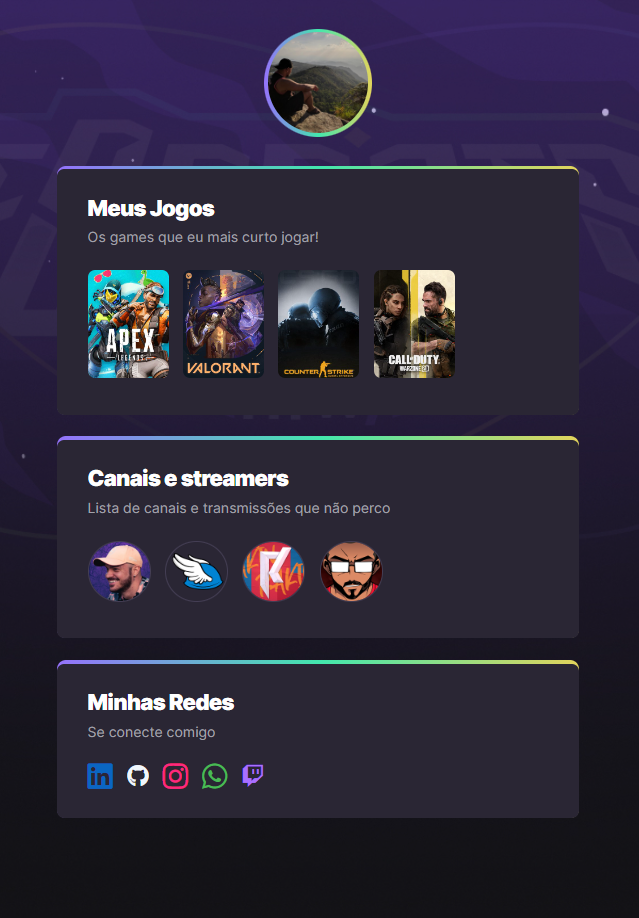

<h1 align="center"> NLW eSports </h1>

NLW é um evento exclusivo e gratuito, promovido pela Rocketseat para ensino de tecnologias WEB.  

 

  

 
## 🚀 Tecnologias

Esse projeto foi desenvolvido com as seguintes tecnologias:

- HTML e CSS
- Git e Github
- Figma

 

## 💻 Projeto

Esse é um site agregador de links na temática eSports

- [Visite o projeto online](https://weversonmp.github.io/nlw-esports)

 

## 🔖 Layout

Você pode visualizar o layout do projeto através [DESSE LINK](https://www.figma.com/file/LCxyf9gmop97h6gzNtr9x8/NLW-eSports-(Community)?node-id=79-2502&t=94Bog9rxHqISqMqu-0). É necessário ter conta no [Figma](https://figma.com) para acessá-lo.

 

## 📝 Licença

Esse projeto está sob a licença MIT.

 
 
 
 

---
